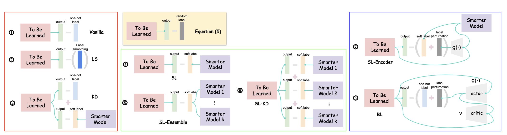

Label Optimization(under review at ICCV2021)
================================
<!-- <div style="text-align:center"></div>  -->


benchmarks 
-----------
11 state-of-the-art knowledge distillation methods

(KD) - Distilling the Knowledge in a Neural Network  
(FitNet) - Fitnets: hints for thin deep nets  
(AT) - Paying More Attention to Attention: Improving the Performance of Convolutional Neural Networks
    via Attention Transfer  
(SP) - Similarity-Preserving Knowledge Distillation  
(VID) - Variational Information Distillation for Knowledge Transfer  
(RKD) - Relational Knowledge Distillation  
(PKT) - Probabilistic Knowledge Transfer for deep representation learning  
(AB) - Knowledge Transfer via Distillation of Activation Boundaries Formed by Hidden Neurons  
(FT) - Paraphrasing Complex Network: Network Compression via Factor Transfer  
(CRD) - Contrastive Representation Distillation
(KDSS) - Self-Supervised Knowledge Distillation for Cross Domain Adaptive Person Re-Identification

 Benchmark Results on CIFAR-100
 -------------------------------
 The difference between the vanilla performance of the student network and the performance after applying KD
 
|    Method   	|    Student   	|   Teacher   	| acc. gap 	|
|:-----------:	|:------------:	|:-----------:	|:--------:	|
|      KD     	|  R20(69.63)  	|  R56(73.44) 	|   1.03   	|
|    FitNet   	|      R20     	|     R56     	|   1.97   	|
|      AT     	|      R20     	|     R56     	|   2.15   	|
|      SP     	|      R20     	|     R56     	|   1.85   	|
|     VID     	|      R20     	|     R56     	| **2.08**  |
|     RKD     	|      R20     	|     R56     	|   1.85   	|
|     PKT     	|      R20     	|     R56     	|   1.81   	|
|      AB     	|      R20     	|     R56     	|   1.86   	|
|      FT     	|      R20     	|     R56     	|   1.89   	|
|     CRD     	|      R20     	|     R56     	|   2.05   	|
|     KDSS    	|      R20     	|     R56     	|   1.86   	|
| Our (SK-KD) 	|  R20 (67.66) 	| R56 (69.67) 	|   1.99   	|
| Our (SK-KD) 	| R110 (71.59) 	| R56 (75.34) 	| **3.75**  |

Performance change according to label generation method with CIFAR100
---------------------------------------------------------------------
|  Method 	| Student 	| Teacher 	|    acc.     	|      ECE      	|
|:-------:	|:-------:	|:-------:	|:----------: 	|:-------------:	|
| Vanilla 	|   R20   	|    -    	|  67.66±0.05 	|   0.065±0.0   	|
|    LS   	|         	|    -    	|  67.84±0.24 	| 0.0627±0.0005 	|
|  random 	|         	|         	|   1.00±0.0  	|    0.0±0.0    	|
|    KD   	|         	|   R32   	|  68.20±0.46 	|  0.061±0.0024 	|
|    SL   	|         	|   R44   	|  69.17±0.17 	| 0.0213±0.0025 	|
|  SL-Enc 	|         	|   R32   	|  69.33±0.06 	|  0.016±0.0024 	|
|  SL-Ens 	|         	|    -    	|  69.66±0.37 	| 0.0467±0.0037 	|
|  SL-KD  	|         	|    -    	|**69.67±0.15**|  0.014±0.0014 	|
| Vanilla 	|   R110  	|    -    	|  71.59±0.63	 |  0.144±0.0051 	|
|    LS   	|         	|    -    	|  71.62±1.3   | 0.0363±0.0046 	|
|    KD   	|         	|   R32   	|  71.93±0.78  | 0.1357±0.0025 	|
|    SL   	|         	|   R44   	|  74.21±0.25  | 0.0353±0.0009 	|
|  SL-Enc 	|         	|   R32   	|  74.11±0.17  | 0.0213±0.0009 	|
|  SL-Ens 	|         	|    -    	|  75.04±0.31  | 0.0603±0.0029 	|
|  SL-KD  	|         	|    -    	|**75.34±0.29**| 0.0117±0.0021 	|

Runing
--------
1. download teacher model or train teacher network model from scrach.  

```
bach bashfile/download_teacher.bash
```

```
bach bashfile/run_vanilla.bash
```
2. Training 
```
python main.py --is_smart_model --smart_model resnet20 --smart_model_path ./checkpoints/ --student_model resnet20  --result ./results --dataset cifar100 --n_class 100 --batch_size 128 --lr 0.1 --wd 5e-4 --epochs 200 --method SL
```
where the flags are explained as:
  * `--student_model`: the student model, check the available model arch
  * `--dataset`:  the dataset to train
  * `--method`: the method of the training
  * `--smart_model`: the teacher model
  * `--smart_model_path`: path of the teacher model
  <!-- * `--lr`: the learning rate, default: 0.1
  * `--weigth_decay`: the weight decay, default: 5e-4
  * `--epochs`: total epoch, default: 200 -->
check the dataset & models
* Dataset
  * CIFAR10 (torchvision)
  * CIFAR100 (torchvision)
  * STL10 (torchvision)
  * ImageNet (torchvision)
* Models
    * CIFAR10, 100, STL10 -> ResNet 20,32,44,56,110
    * ImageNet -> ResNet 18,34,50,101,152
